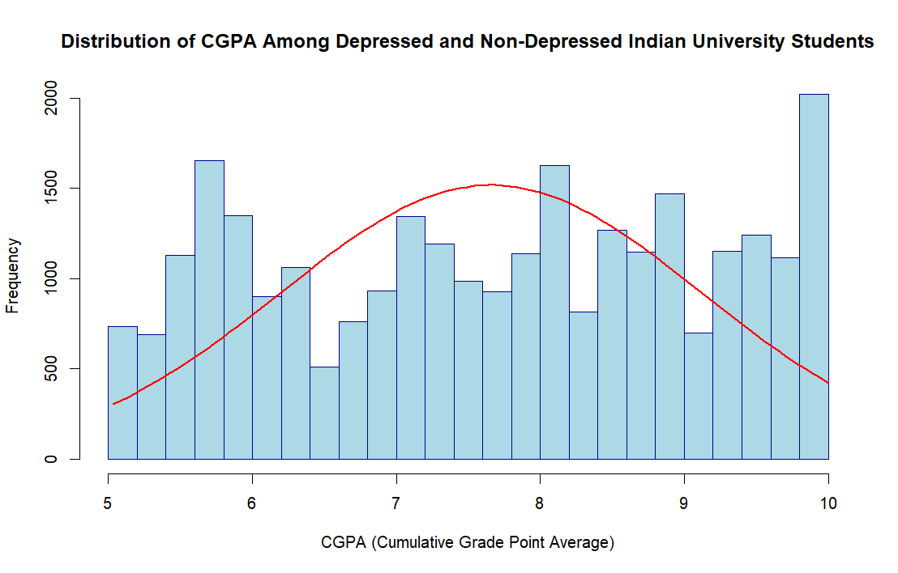

## Research Question (RQ)
"Is there a difference in the median student academic score (Cumulative Grade Point Average (CGPA)) between depressed and non-depressed University students in India?"

### Dataset
https://www.kaggle.com/datasets/adilshamim8/student-depression-dataset/data

## Phase I
- [x] Identify Columns
- [x] RQ
- [x] Rename Columns
- [x] Clean Dataset (remove rows with missing data)
- [x] Boxplot
- [x] Pie Chart
- [x] Histogram (Check Distribution)
- [x] Hypothesis Testing (Find Mean, T Test)
- [x] Find P-value whether greater or less than alpha
- [x] Reject null hypothesis or not
- [x] Presentation of Hypothesis

## Phase II (Create Report)
- [x] Study 3 Research Papers (Background)
- [x] Visualization
- [x] Analysis
- [x] Conclusions
- [x] References
- [x] Appendices

### Visualizations

### How to Run
- Open `Student Depression.R` in RStudio or VS Code.
- Ensure `dataset.csv` is in the project root.
- Install dependencies: `tidyverse`.
- Run the script to reproduce cleaning, analysis, and plots.
