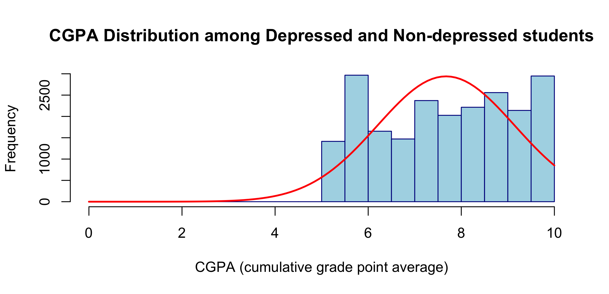
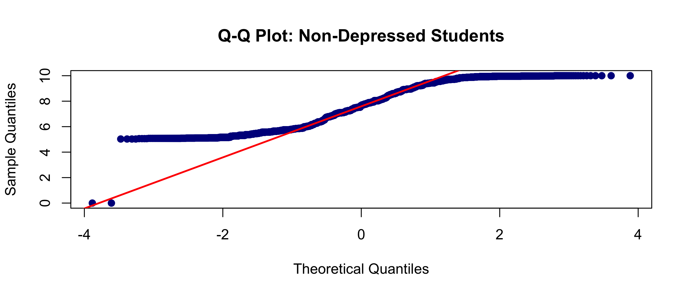
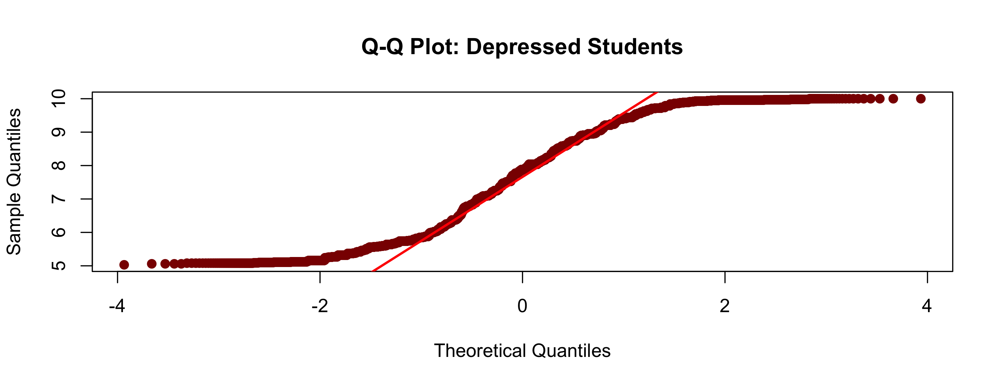

## Research Question (RQ): "Is there a difference in the median student academic score (Cumulative Grade Point Average (CGPA)) between depressed and non-depressed University students in India?"

### Dataset : https://www.kaggle.com/datasets/adilshamim8/student-depression-dataset/data

Phase I
## - [x] Identify Columns
## - [x] RQ
## - [x] Rename Columns
## - [x] Clean Dataset (remove rows with missing data)
## - [x] Pie Chart

## - [x] Histogram (Check Distribution)

## - [x] Boxplot
## - [x] QQ Plots

## - [x] Hypothesis Testing (Find Mean, T test/wilcox test)
## - [x] Find Pvalue wether is greater or less than alpha
## - [x] Reject null hypothesis or not
## - [x] Presentation of Hypothesis

Phase II (Create Report):
- [ ] Study 3 Research Papers (Background)
- [ ] Visualisation
- [ ] Analysis
- [ ] Conclusions
- [ ] References
- [ ] Appendices
